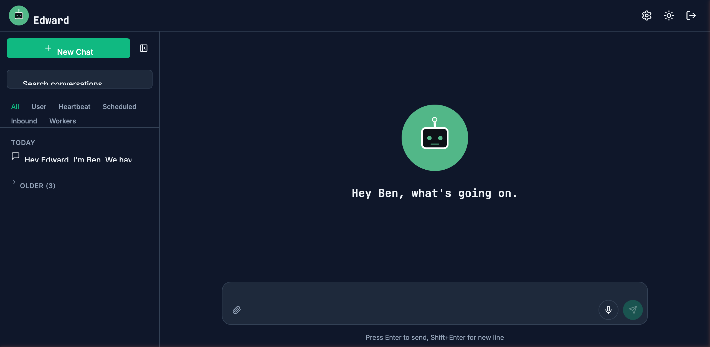
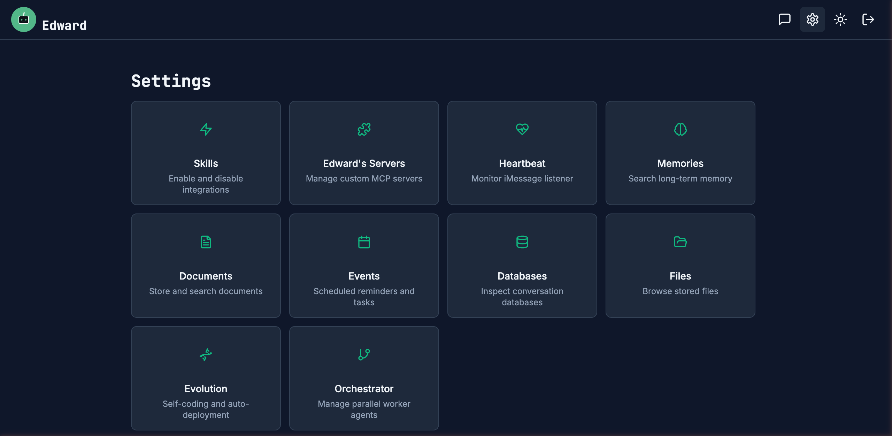
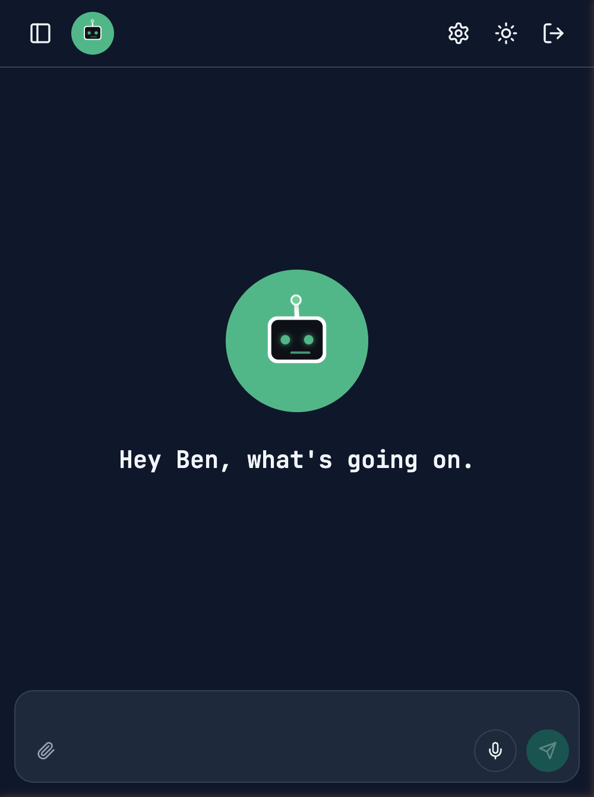
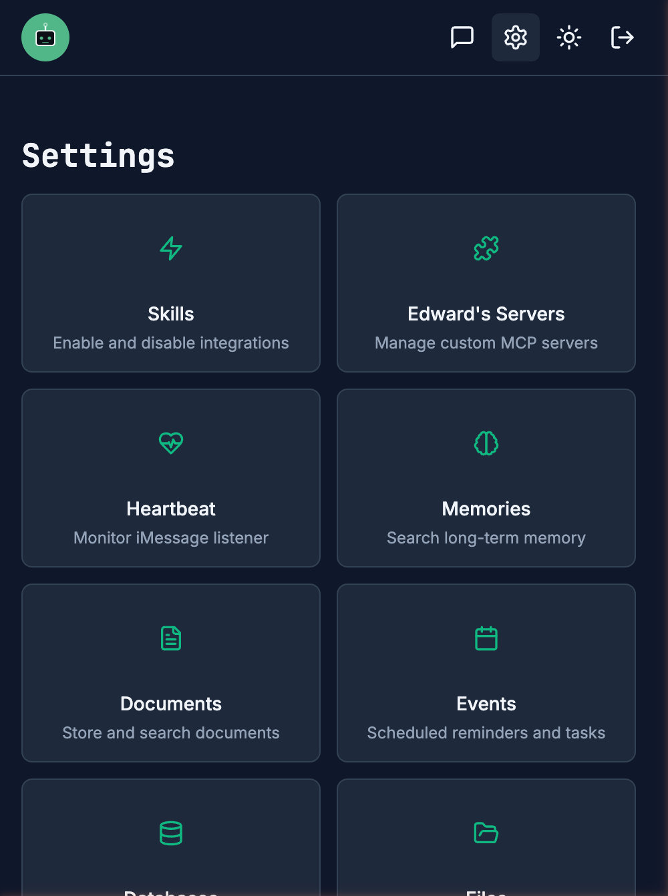

<p align="center">
  
</p>

<h1 align="center">Edward</h1>

<p align="center">
  <strong>An open-source AI assistant that remembers every conversation, evolves its own code, and runs on your machine.</strong>
</p>

<p align="center">
  <a href="LICENSE"></a>
  <a href="https://github.com/ben4mn/meet-edward/stargazers"></a>
  <a href="CONTRIBUTING.md"></a>
  <a href="https://github.com/ben4mn/meet-edward/commits/main"></a>
  <a href="https://meet-edward.com"></a>
</p>

<p align="center">
  <a href="https://meet-edward.com">Website</a> &nbsp;·&nbsp;
  <a href="https://meet-edward.com/docs">Docs</a> &nbsp;·&nbsp;
  <a href="https://meet-edward.com/blog">Blog</a> &nbsp;·&nbsp;
  <a href="#quick-start">Quick Start</a> &nbsp;·&nbsp;
  <a href="https://youtu.be/uewYlQma1QY">Video Walkthrough</a>
</p>

---

## Demo

<p align="center">
  <a href="https://youtu.be/uewYlQma1QY">
    
  </a>
</p>

## Screenshots

<p align="center">
  
</p>

<p align="center">
  
</p>

<details>
<summary><strong>Mobile</strong></summary>

<p align="center">
  
  &nbsp;&nbsp;
  
</p>

</details>

## Why Edward?

Most AI assistants are stateless — every conversation starts from scratch. Edward is different:

- **Persistent memory** — Hybrid vector + keyword retrieval across every conversation. Edward knows your name, your preferences, your projects.
- **Proactive awareness** — The heartbeat system monitors iMessage, Calendar, and Mail, then briefs you on what you missed.
- **Self-evolution** — Edward can propose, test, and deploy improvements to its own codebase via Claude Code.
- **Multi-agent orchestration** — Spawns worker agents that run tasks in parallel while you're away.
- **Self-hosted** — Runs on your machine. Your data never leaves your hardware.

## Features

| | | | |
|:--|:--|:--|:--|
| **Long-Term Memory** | Hybrid vector + keyword recall | **Scheduled Events** | One-time & cron recurring |
| **Multi-Channel Messaging** | iMessage, SMS, WhatsApp | **Code Execution** | Python, JS, SQL, Shell sandboxes |
| **Apple Services** | Calendar, Mail, Reminders, Notes | **Web Search** | Brave Search + page extraction |
| **Document Store** | Semantic search over saved docs | **Custom MCP Servers** | Self-serve install at runtime |
| **Multi-Agent Orchestrator** | Spawns parallel worker agents | **Self-Evolution** | Proposes, tests, and deploys its own upgrades |
| **Push Notifications** | Web Push via VAPID | **File Storage** | Persistent files with tags |

## Quick Start

```bash
git clone https://github.com/ben4mn/meet-edward.git && cd meet-edward
./setup.sh            # Installs PostgreSQL, pgvector, Python & Node deps
./restart.sh           # Starts backend (:8000) + frontend (:3000)
```

Add your Anthropic API key to `.env` — that's the only required variable. Open [localhost:3000](http://localhost:3000) and set a password on first visit.

> **Prerequisites:** macOS, [Homebrew](https://brew.sh), Python 3.11+, Node.js 18+, [Anthropic API key](https://console.anthropic.com/)

## Architecture

```
Frontend (Next.js :3000)  →  Backend (FastAPI :8000)  →  PostgreSQL (:5432)
                                      ↓
                              LangGraph Agent
                           (preprocess → retrieve
                            memory → respond →
                            extract memory)
                                      ↓
                              Claude API (Anthropic)
```

The backend runs natively on macOS (not in Docker) to support iMessage, AppleScript, and the scheduled event scheduler.

## Platform Support

Edward is built for macOS, where it integrates with iMessage, Calendar, Mail, and other Apple services. On **Windows** (via WSL) or **Linux**, the core assistant — memory, chat, scheduling, code execution, orchestration, and evolution — works fully. See the [Platform Support](https://meet-edward.com/docs/platform-support) docs for details.

<details>
<summary><strong>Background Systems</strong></summary>

| System | Description |
|--------|-------------|
| Heartbeat | Monitors iMessage, Calendar, and Mail; triages by urgency |
| Memory Reflection | Post-turn enrichment via related memory queries |
| Deep Retrieval | Pre-turn multi-query search for complex conversations |
| Memory Consolidation | Hourly clustering of related memories |
| Search Tags | Auto-generated keywords for conversation search |

</details>

<details>
<summary><strong>Configuration</strong></summary>

Copy [`.env.example`](.env.example) to `.env` and configure:

| Variable | Required | Description |
|----------|----------|-------------|
| `ANTHROPIC_API_KEY` | Yes | Claude API key |
| `BRAVE_SEARCH_API_KEY` | No | Enables web search |
| `TWILIO_ACCOUNT_SID` / `AUTH_TOKEN` / `PHONE_NUMBER` | No | SMS & WhatsApp messaging |
| `MCP_APPLE_ENABLED` | No | Apple Services (Calendar, Mail, etc.) |
| `VAPID_PUBLIC_KEY` / `PRIVATE_KEY` | No | Browser push notifications |
| `JWT_SECRET_KEY` | No | Auth secret (auto-generates if unset) |
| `GITHUB_TOKEN` | No | MCP server search via GitHub API |
| `HTML_HOSTING_API_KEY` | No | HTML page hosting |

See [`.env.example`](.env.example) for the full list.

</details>

## Scripts

```bash
./setup.sh              # First-time setup (PostgreSQL, dependencies, .env)
./restart.sh             # Restart both frontend and backend
./restart.sh frontend    # Restart only frontend
./restart.sh backend     # Restart only backend
```

Logs: `/tmp/edward-backend.log` and `/tmp/edward-frontend.log`

## Learn More

- [Documentation](https://meet-edward.com/docs) — Architecture, setup guides, and feature deep-dives
- [Blog](https://meet-edward.com/blog) — Articles on AI memory, self-evolution, and building Edward

## Contributing

Contributions welcome! See [CONTRIBUTING.md](CONTRIBUTING.md) for development setup and guidelines. Open an issue first to discuss what you'd like to change.

## License

[Apache 2.0](LICENSE)
